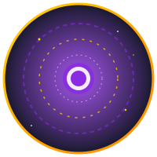
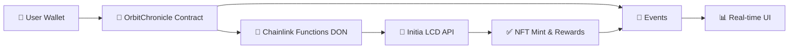

<div align="center">

<h1>🪐 OrbitChronicle</h1>



<h3>Cross-Chain Loyalty System</h3>
<p><strong>LOYALTY ACROSS THE COSMOS</strong></p>
<p>Revolutionary blockchain loyalty system connecting Cosmos and EVM ecosystems using Chainlink Functions</p>

<p>Experience delegation verification with live tracking, IPFS-enhanced NFTs, and instant rewards in a stunning cyberpunk interface! 🌌</p>

<a href="https://keplr-jeju-ideathon.vercel.app/">🚀 Live Demo</a>
·
<a href="https://keplr-ideathon.vercel.app/">📊 Interactive Slides</a>
·
<a href="https://youtu.be/AyYbSVEyesA?feature=shared">🎥 Video Presentation</a>

</div>

## Table of Contents

- [Key Features](#key-features)
- [How It Works](#how-it-works)
- [Delegation Tiers](#delegation-tiers)
- [Tech Stack](#tech-stack)
- [Video Presentation](#video-presentation)
- [Live Demo](#live-demo)
- [Project Structure](#project-structure)
- [Design Philosophy](#design-philosophy)

## ⭐ Key Features

- 🔗 **Chainlink Functions**: Automated cross-chain delegation verification via DON
- 🎨 **Dynamic NFTs**: Tier-based soulbound tokens with IPFS graphics
- 📊 **Live Dashboard**: Real-time status via The Graph indexing with cyberpunk styling
- ⚡ **Instant Rewards**: Weekly benefits and immediate gratification
- 🌌 **Immersive UI**: Space-themed background with orbit rings and nebula effects

## 🚀 How It Works



1. **Connect** both EVM and Cosmos wallets through our sleek interface
2. **Request** delegation verification via Chainlink Functions
3. **Execute** cross-chain data fetching with DON consensus
4. **Receive** tier-based soulbound NFT with instant rewards
5. **Track** progress with real-time updates via The Graph indexing

## 🏆 Delegation Tiers

| 🪨 Asteroid   | ☄️ Comet      | ⭐ Star       | 🌌 Galaxy     |
| ------------- | ------------- | ------------- | ------------- |
| 5+ INIT       | 20+ INIT      | 100+ INIT     | 1000+ INIT    |
| Basic rewards | 2x multiplier | 3x multiplier | 5x multiplier |

## 🛠️ Tech Stack

- **Contracts**: Solidity on Base Sepolia with comprehensive event emission
- **Functions**: Chainlink DON (Decentralized Oracle Network)
- **Frontend**: Next.js + wagmi + Keplr + Framer Motion
- **Indexing**: The Graph Protocol for real-time event tracking
- **Storage**: IPFS for premium graphics and metadata
- **Styling**: Tailwind CSS with cyberpunk theme
- **Animations**: Advanced CSS effects and smooth state transitions

### 🔄 Technical Evolution

Initially planned to use **vlayer** for on-chain ZK proof verification, but switched to **Chainlink Functions** due to service stability issues. This pivot enabled more reliable cross-chain delegation verification while maintaining the same user experience.

## 🎥 Video Presentation

[](https://youtu.be/AyYbSVEyesA?feature=shared)

## 🌟 Live Demo

- **App**: [keplr-jeju-ideathon.vercel.app](https://keplr-jeju-ideathon.vercel.app)
- **Presentation Slides**: [keplr-ideathon.vercel.app](https://keplr-ideathon.vercel.app)
- **Contracts**: Base Sepolia
  - OrbitChronicle: [0x5F131D2C6ea405d8e57845a409CcE5B168176634](https://sepolia.basescan.org/address/0x5F131D2C6ea405d8e57845a409CcE5B168176634)
  - OrbitChronicleNFT: [0x3D14794D6bC6B67E4C335F922AE0DeBfE4dFC648](https://sepolia.basescan.org/address/0x3D14794D6bC6B67E4C335F922AE0DeBfE4dFC648)

## 📁 Project Structure

```
keplr-ideathon/
├── assets/          # 🎨 NFT designs & examples
├── contracts/       # 🔷 Solidity smart contracts
├── verifier-api/    # 🌐 Chainlink Functions runtime
├── subgraph/        # 📊 The Graph indexer for real-time events
└── frontend/        # 💻 Next.js web app
    ├── components/  # 🧩 UI components
    │   ├── background/  # 🌌 Space background effects
    │   ├── tabs/        # 📑 Navigation and cards
    │   └── orbit/       # ⚡ Registration flow
    └── app/         # 📄 Next.js app router
```

### 📖 Detailed Documentation

Each directory contains comprehensive documentation for developers:

- **[Frontend Documentation](./frontend/README.md)** - Next.js setup, React components, wallet integration, and UI development guide
- **[Smart Contracts Documentation](./contracts/README.md)** - Solidity contracts, Foundry usage, deployment instructions, and ABI generation
- **[Verifier API Documentation](./verifier-api/README.md)** - Chainlink Functions implementation, Vercel deployment, API endpoints, and testing guide
- **[Assets Documentation](./assets/README.md)** - NFT designs, SVG examples, IPFS integration, and visual identity guidelines

💡 **Pro tip**: Check out these detailed READMEs to understand the implementation details, setup instructions, and architecture decisions for each component!

## 🎯 Design Philosophy

**Trust Cosmos's Built-in Mechanisms**

Instead of complex enforcement, we leverage:

- ⏳ 21-day unbonding period (natural commitment)
- 🔒 Redelegation cooldowns (anti-gaming)
- 📸 Moment-in-time verification (achievement recognition)

**Focus on Immediate Value & User Experience**

- 🎁 Weekly benefits over long-term accumulation
- ⚡ Instant rewards and tier upgrades
- 🏆 Active participation over passive holding
- 🌌 Immersive interface that makes DeFi feel like the future

---

**🪐 Built for Keplr Ideathon** | **✨ Powered by Chainlink Functions** | **📄 [MIT License](LICENSE)**
