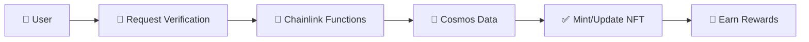

# 🪐 OrbitRewards: Cross-Chain Loyalty System

**Revolutionary blockchain loyalty system connecting Cosmos and EVM ecosystems using Chainlink Functions**

Experience delegation verification with live tracking, IPFS-enhanced NFTs, and instant rewards! 🌌

## ⭐ Key Features

- 🔗 **Chainlink Oracle**: Automated cross-chain delegation verification
- 🎨 **Dynamic NFTs**: Tier-based soulbound tokens with IPFS graphics
- 📊 **Live Dashboard**: Real-time status and benefit tracking
- ⚡ **Instant Rewards**: Weekly benefits and immediate gratification

## 🚀 How It Works



1. **Connect** both EVM and Cosmos wallets
2. **Verify** your delegation status via Chainlink oracle
3. **Receive** tier-based soulbound NFT
4. **Enjoy** weekly benefits and instant rewards

## 🏆 Delegation Tiers

| 🪨 Asteroid   | ☄️ Comet      | ⭐ Star       | 🌌 Galaxy     |
| ------------- | ------------- | ------------- | ------------- |
| 5+ INIT       | 20+ INIT      | 100+ INIT     | 1000+ INIT    |
| Basic rewards | 2x multiplier | 3x multiplier | 5x multiplier |

## 🎨 Galaxy NFT Example

<div align="center">
  
</div>

**Features**: IPFS graphics • Rounded clipping • Glow effects • On-chain fallback

## 🛠️ Tech Stack

- **Contracts**: Solidity on Base Sepolia
- **Oracle**: Chainlink Functions
- **Frontend**: Next.js + wagmi + Keplr
- **Indexing**: The Graph Protocol
- **Storage**: IPFS for premium graphics

## 🌟 Live Demo

- **App**: [keplr-ideathon.vercel.app](https://keplr-ideathon.vercel.app)
- **Contracts**: Base Sepolia
  - OrbitRewards: `0x905330700Ceb47D1121ef6e9BdB248F18375ebca`
  - OrbitRewardsNFT: `0xf8078A3AD0E897D2164F7816D17F575d72a79C41`

## 📁 Project Structure

```
keplr-ideathon/
├── assets/          # 🎨 NFT designs & examples
├── contracts/       # 🔷 Solidity smart contracts
├── verifier-api/    # 🌐 Chainlink Functions runtime
├── subgraph/        # 📊 The Graph indexer
└── frontend/        # 💻 Next.js web app
```

## 🎯 Design Philosophy

**Trust Cosmos's Built-in Mechanisms**

Instead of complex enforcement, we leverage:

- ⏳ 21-day unbonding period (natural commitment)
- 🔒 Redelegation cooldowns (anti-gaming)
- 📸 Moment-in-time verification (achievement recognition)

**Focus on Immediate Value**

- 🎁 Weekly benefits over long-term accumulation
- ⚡ Instant rewards and tier upgrades
- 🏆 Active participation over passive holding

---

**🪐 Built for Keplr Ideathon** | **✨ Powered by Chainlink Functions** | **📄 [MIT License](LICENSE)**
