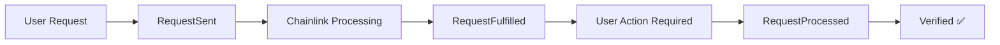

# 🪐 OrbitRewards: Stellar Loyalty Verification System

## 🚀 Overview

**OrbitRewards** is a revolutionary blockchain loyalty system for Cosmos ecosystem using **Chainlink Functions**, **Real-time GraphQL**, and **Soulbound NFT Technology**.

Experience seamless delegation verification with live dashboard tracking, NFT rewards, and automated scoring! 🌌

## ⭐ Key Features

- 🔗 **Chainlink Functions**: Automated delegation verification via external APIs
- 🎨 **Soulbound NFTs**: Tier-based non-transferable tokens with dynamic SVG designs
- 📊 **Real-time Dashboard**: Live contract data and request status monitoring
- 🌐 **Web3 Integration**: Seamless EVM + Cosmos wallet connectivity

## 🏗️ Technical Architecture

### 📋 **3-Stage Request Processing Flow**



1. **RequestSent**: User initiates delegation verification
2. **RequestFulfilled**: Chainlink Functions processes the request
3. **RequestProcessed**: User completes verification (Manual trigger)

### 🔧 **Smart Contract System**

#### OrbitRewards.sol - Main Contract

```solidity
// Request delegation verification (for the first time)
function requestDelegationTier(string calldata bech32Address) external returns (bytes32 requestId)

// Request loyalty verification (for the second and later times)
function requestLoyaltyVerification(string calldata bech32Address) external returns (bytes32 requestId)

// Process fulfilled requests
function processRequest(bytes32 requestId) external

// Get user status
function getUserStatus(address user) external view returns (UserStatusInfo)
```

#### OrbitRewardsNFT.sol - NFT Contract

```solidity
// Mint soulbound NFT
function mintNFT(address to, DelegationTier tier, uint256 amount) external returns (uint256)

// Get NFT metadata with SVG
function tokenURI(uint256 tokenId) external view returns (string)

// Update NFT data
function updateTokenMetadata(uint256 tokenId, DelegationTier tier, uint256 amount) external
```

### 🌐 **Frontend Architecture**

#### Real-time Data Hooks

```typescript
// Main data hook
const orbitData = useOrbitRewardsData();

// Request status tracking
const { stats } = useRequestStatusSimple(address);

// Contract interactions
const { requestVerification, processRequest } = useOrbitRewards();
```

#### Key Components

- **Dashboard**: Real-time user status and NFT display
- **NFTDisplay**: Dynamic SVG rendering with fallback
- **RequestStatusSimple**: Live request tracking with 3-stage visualization
- **OrbitRewardsFlow**: Step-by-step verification process

## 🎯 User Experience Flow

### 1. **Initial Registration**

```javascript
// Check eligibility
const canRegister = await checkDelegationEligibility(cosmosAddress);

// Register and mint NFT
if (canRegister) {
  const requestId = await requestDelegationTier();
  // Wait for Chainlink processing...
  await processRequest(requestId);
  // NFT minted with tier-based design!
}
```

### 2. **Ongoing Verification**

```javascript
// Check verification timing
const timeUntilNext = await getNextVerificationTime();

// Request verification (every 7-14 days)
if (timeUntilNext === 0) {
  const requestId = await requestDelegationTier();
  // Process when fulfilled
  await processRequest(requestId);
}
```

### 3. **Dashboard Monitoring**

- **Live NFT Display**: See your soulbound NFT with SVG graphics
- **Real-time Stats**: Current score, boost points, verification count
- **Request Tracking**: Monitor pending/fulfilled/processed requests
- **Tier Progress**: Track delegation tier and scoring status

## 📊 Scoring & Rewards System

### 🏆 **Delegation Tiers**

| Tier        | Min Delegation | Base Score    | NFT Design            |
| ----------- | -------------- | ------------- | --------------------- |
| 🪨 Asteroid | 5 INIT         | 1 point/day   | Gray rocky design     |
| ☄️ Comet    | 20 INIT        | 3 points/day  | Blue icy design       |
| ⭐ Star     | 100 INIT       | 8 points/day  | Golden stellar design |
| 🌌 Galaxy   | 1000 INIT      | 20 points/day | Purple cosmic design  |

### 🎯 **Scoring Mechanics**

- **Daily Points**: Earned automatically when score is active
- **Verification Cycles**: 21-day scoring windows, 14-day verification cycles
- **Boost Multipliers**: Special events and achievements
- **Penalty System**: Score deactivation for missed verifications

### 🎨 **NFT Rewards**

- **Dynamic SVG**: On-chain generated graphics based on tier
- **Soulbound**: Non-transferable, representing loyalty commitment
- **Upgradeable**: Tier changes update NFT metadata automatically
- **Collectible**: Season-end special NFTs for active participants

## 🔍 Real-time Request Monitoring

### Request Status Dashboard

```
📊 Request Status
┌─────────┬─────────┬──────────┐
│  Total  │ Pending │ Verified │
│    5    │    1    │     4    │
└─────────┴─────────┴──────────┘

🟡 1 request(s) pending Chainlink fulfillment
🟢 All other requests completed
```

### Status Indicators

- **🔵 Total**: All user requests ever made
- **🟡 Pending**: Waiting for Chainlink Functions processing
- **🟠 Ready**: Fulfilled, awaiting user action
- **🟢 Verified**: Successfully completed

## 📁 Project Structure

```
keplr-ideathon/
├── 📄 LICENSE                    # MIT License
├── 📄 README.md                  # Project documentation
├── 📂 contracts/                 # Smart contracts (Foundry)
│   ├── 📂 src/                   # Contract source files
│   │   ├── OrbitRewards.sol      # Main loyalty contract
│   │   └── OrbitRewardsNFT.sol   # Soulbound NFT contract
│   ├── 📂 script/                # Deployment scripts
│   ├── 📂 test/                  # Contract tests
│   └── 📂 lib/                   # Dependencies (Chainlink, OpenZeppelin)
├── 📂 frontend/                  # Next.js Web3 frontend
│   ├── 📂 app/                   # Next.js App Router
│   ├── 📂 components/            # React components
│   │   ├── 📂 orbit/             # Orbit-specific components
│   │   ├── 📂 tabs/              # Tab navigation
│   │   └── NFTDisplay.tsx        # SVG NFT renderer
│   ├── 📂 hooks/                 # Custom React hooks
│   │   ├── useOrbitRewardsData.ts # Main data hook
│   │   └── useRequestStatus.ts    # Request monitoring
│   ├── 📂 context/               # React context providers
│   └── 📂 utils/                 # Utilities and constants
├── 📂 subgraph/                  # The Graph indexer
│   ├── 📂 src/                   # GraphQL mapping functions
│   ├── schema.graphql            # Data schema
│   └── subgraph.yaml            # Configuration
└── 📂 verifier-api/             # Vercel API backend
    ├── 📂 api/                   # API endpoints
    │   ├── verify.ts             # Delegation verification
    │   └── health.ts             # Health check
    └── 📂 src/                   # Business logic
        └── delegation-service.ts  # Cosmos API integration
```

## 🛠️ Technical Stack

### **Blockchain**

- **Contracts**: Solidity on Base Sepolia
- **Oracle**: Chainlink Functions for external API calls
- **NFTs**: ERC-721 soulbound tokens with on-chain SVG

### **Backend**

- **API**: Vercel serverless functions
- **Database**: GraphQL with The Graph protocol
- **External APIs**: Cosmos/Initia delegation data

### **Frontend**

- **Framework**: Next.js 14 with TypeScript
- **Web3**: wagmi + viem for Ethereum interaction
- **Cosmos**: Keplr wallet integration
- **UI**: TailwindCSS with custom cyberpunk theme
- **State**: React hooks with real-time updates

## 🌟 Live Deployment

### **Production URLs**

- **Frontend**: `https://keplr-ideathon.vercel.app`
- **API**: `https://keplr-ideathon.vercel.app/api/verify`
- **GraphQL**: Real-time request monitoring

### **Contract Addresses (Base Sepolia)**

- **OrbitRewards**: `0x905330700Ceb47D1121ef6e9BdB248F18375ebca`
- **OrbitRewardsNFT**: `0xf8078A3AD0E897D2164F7816D17F575d72a79C41`

## 📄 License

- [MIT License](LICENSE)

---

**🪐 Built for Keplr Ideathon** | **✨ Powered by Chainlink Functions**
