<div align="center">

<h1>🪐 OrbitChronicle</h1>
<iframe src="data:text/html;charset=utf-8,%3C!DOCTYPE%20html%3E%3Chtml%3E%3Chead%3E%3Cmeta%20charset%3D%22utf-8%22%3E%3Cstyle%3Ebody%7Bmargin%3A0%3Bpadding%3A8px%3Bbackground%3Atransparent%3Bdisplay%3Aflex%3Balign-items%3Acenter%3Bjustify-content%3Acenter%3Bmin-height%3A100vh%7Dsvg%7Bmax-width%3A100%25%3Bmax-height%3A100%25%3Bwidth%3Aauto%3Bheight%3Aauto%7D%3C/style%3E%3C/head%3E%3Cbody%3E%3Csvg%20xmlns%3D%22http%3A//www.w3.org/2000/svg%22%20width%3D%22400%22%20height%3D%22400%22%20viewBox%3D%220%200%20400%20400%22%3E%3Cdefs%3E%3CradialGradient%20id%3D%22bg%22%20cx%3D%2250%25%22%20cy%3D%2230%25%22%20r%3D%2270%25%22%3E%3Cstop%20offset%3D%220%25%22%20style%3D%22stop-color%3A%238A2BE2%3Bstop-opacity%3A0.9%22/%3E%3Cstop%20offset%3D%2250%25%22%20style%3D%22stop-color%3A%231a1a2e%3Bstop-opacity%3A0.8%22/%3E%3Cstop%20offset%3D%22100%25%22%20style%3D%22stop-color%3A%230d0d1a%3Bstop-opacity%3A1%22/%3E%3C/radialGradient%3E%3ClinearGradient%20id%3D%22cardGrad%22%20x1%3D%220%25%22%20y1%3D%220%25%22%20x2%3D%22100%25%22%20y2%3D%22100%25%22%3E%3Cstop%20offset%3D%220%25%22%20style%3D%22stop-color%3A%238A2BE2%3Bstop-opacity%3A0.3%22/%3E%3Cstop%20offset%3D%22100%25%22%20style%3D%22stop-color%3A%23ffffff%3Bstop-opacity%3A0.1%22/%3E%3C/linearGradient%3E%3ClinearGradient%20id%3D%22goldGrad%22%20x1%3D%220%25%22%20y1%3D%220%25%22%20x2%3D%22100%25%22%20y2%3D%22100%25%22%3E%3Cstop%20offset%3D%220%25%22%20style%3D%22stop-color%3A%23FFD700%22/%3E%3Cstop%20offset%3D%2250%25%22%20style%3D%22stop-color%3A%23FFA500%22/%3E%3Cstop%20offset%3D%22100%25%22%20y2%3D%22100%25%22%3E%3Cstop%20offset%3D%220%25%22%20style%3D%22stop-color%3A%23FFD700%22/%3E%3Cstop%20offset%3D%2250%25%22%20style%3D%22stop-color%3A%23FFA500%22/%3E%3Cstop%20offset%3D%22100%25%22%20style%3D%22stop-color%3A%23FF8C00%22/%3E%3C/linearGradient%3E%3Cfilter%20id%3D%22glow%22%20x%3D%22-50%25%22%20y%3D%22-50%25%22%20width%3D%22200%25%22%20height%3D%22200%25%22%3E%3CfeGaussianBlur%20stdDeviation%3D%223%22%20result%3D%22coloredBlur%22/%3E%3CfeMerge%3E%3CfeMergeNode%20in%3D%22coloredBlur%22/%3E%3CfeMergeNode%20in%3D%22SourceGraphic%22/%3E%3C/feMerge%3E%3C/filter%3E%3Cfilter%20id%3D%22specialGlow%22%20x%3D%22-50%25%22%20y%3D%22-50%25%22%20width%3D%22200%25%22%20height%3D%22200%25%22%3E%3CfeGaussianBlur%20stdDeviation%3D%225%22%20result%3D%22coloredBlur%22/%3E%3CfeMerge%3E%3CfeMergeNode%20in%3D%22coloredBlur%22/%3E%3CfeMergeNode%20in%3D%22SourceGraphic%22/%3E%3C/feMerge%3E%3C/filter%3E%3CclipPath%20id%3D%22roundedClip%22%3E%3Ccircle%20cx%3D%22200%22%20cy%3D%22140%22%20r%3D%2230%22/%3E%3C/clipPath%3E%3C/defs%3E%3Crect%20width%3D%22400%22%20height%3D%22400%22%20fill%3D%22url(%23bg)%22%20rx%3D%2224%22/%3E%3Crect%20x%3D%228%22%20y%3D%228%22%20width%3D%22384%22%20height%3D%22384%22%20fill%3D%22url(%23cardGrad)%22%20rx%3D%2220%22%20opacity%3D%220.5%22/%3E%3Crect%20x%3D%224%22%20y%3D%224%22%20width%3D%22392%22%20height%3D%22392%22%20fill%3D%22none%22%20stroke%3D%22url(%23goldGrad)%22%20stroke-width%3D%223%22%20rx%3D%2222%22%20filter%3D%22url(%23specialGlow)%22/%3E%3Ccircle%20cx%3D%2280%22%20cy%3D%2280%22%20r%3D%221%22%20fill%3D%22white%22%20opacity%3D%220.6%22/%3E%3Ccircle%20cx%3D%22320%22%20cy%3D%22120%22%20r%3D%220.8%22%20fill%3D%22white%22%20opacity%3D%220.4%22/%3E%3Ccircle%20cx%3D%22150%22%20cy%3D%22300%22%20r%3D%221.2%22%20fill%3D%22white%22%20opacity%3D%220.7%22/%3E%3Ccircle%20cx%3D%22350%22%20cy%3D%22280%22%20r%3D%220.6%22%20fill%3D%22white%22%20opacity%3D%220.5%22/%3E%3Ccircle%20cx%3D%2260%22%20cy%3D%22250%22%20r%3D%221%22%20fill%3D%22white%22%20opacity%3D%220.6%22/%3E%3Ccircle%20cx%3D%22300%22%20cy%3D%2260%22%20r%3D%220.8%22%20fill%3D%22white%22%20opacity%3D%220.4%22/%3E%3Ccircle%20cx%3D%22200%22%20cy%3D%22140%22%20r%3D%2265%22%20fill%3D%22%238A2BE2%22%20opacity%3D%220.2%22%20filter%3D%22url(%23specialGlow)%22/%3E%3Ccircle%20cx%3D%22200%22%20cy%3D%22140%22%20r%3D%2250%22%20fill%3D%22%238A2BE2%22%20opacity%3D%220.4%22%20filter%3D%22url(%23specialGlow)%22/%3E%3Ccircle%20cx%3D%22200%22%20cy%3D%22140%22%20r%3D%2235%22%20fill%3D%22white%22%20opacity%3D%220.9%22%20filter%3D%22url(%23specialGlow)%22/%3E%3Ccircle%20cx%3D%22200%22%20cy%3D%22140%22%20r%3D%2225%22%20fill%3D%22%238A2BE2%22%20opacity%3D%220.8%22%20filter%3D%22url(%23specialGlow)%22/%3E%3Ccircle%20cx%3D%22200%22%20cy%3D%22140%22%20r%3D%2280%22%20fill%3D%22none%22%20stroke%3D%22%238A2BE2%22%20stroke-width%3D%221%22%20opacity%3D%220.3%22%20stroke-dasharray%3D%225%2C5%22/%3E%3Ccircle%20cx%3D%22200%22%20cy%3D%22140%22%20r%3D%2295%22%20fill%3D%22none%22%20stroke%3D%22white%22%20stroke-width%3D%220.5%22%20opacity%3D%220.2%22%20stroke-dasharray%3D%223%2C7%22/%3E%3Cimage%20href%3D%22https%3A//ipfs.io/ipfs/bafkreigcz7at4vvsb27zzl4njmplthcdzn5vgtblv4akne2mr3aarsarqy%22%20x%3D%22170%22%20y%3D%22110%22%20width%3D%2260%22%20height%3D%2260%22%20clip-path%3D%22url(%23roundedClip)%22%20filter%3D%22url(%23specialGlow)%22/%3E%3Ccircle%20cx%3D%22200%22%20cy%3D%22140%22%20r%3D%2230%22%20fill%3D%22none%22%20stroke%3D%22%238A2BE2%22%20stroke-width%3D%223%22%20opacity%3D%220.8%22/%3E%3Ccircle%20cx%3D%22200%22%20cy%3D%22140%22%20r%3D%2218%22%20fill%3D%22rgba(255%2C255%2C255%2C0.1)%22%20stroke%3D%22%238A2BE2%22%20stroke-width%3D%222%22%20opacity%3D%220.3%22/%3E%3Ctext%20x%3D%22200%22%20y%3D%22195%22%20text-anchor%3D%22middle%22%20fill%3D%22white%22%20font-size%3D%2220%22%20font-weight%3D%22bold%22%20letter-spacing%3D%222px%22%3EGALAXY%3C/text%3E%3Ctext%20x%3D%22200%22%20y%3D%22220%22%20text-anchor%3D%22middle%22%20fill%3D%22%238A2BE2%22%20font-size%3D%2214%22%20opacity%3D%220.9%22%3E1500%20INIT%3C/text%3E%3Crect%20x%3D%22170%22%20y%3D%22230%22%20width%3D%2260%22%20height%3D%2220%22%20rx%3D%2210%22%20fill%3D%22%238A2BE2%22%20opacity%3D%220.3%22/%3E%3Ctext%20x%3D%22200%22%20y%3D%22243%22%20text-anchor%3D%22middle%22%20fill%3D%22white%22%20font-size%3D%2210%22%20font-weight%3D%22bold%22%3ETIER%204%3C/text%3E%3Crect%20x%3D%22120%22%20y%3D%22265%22%20width%3D%22160%22%20height%3D%2235%22%20rx%3D%2217%22%20fill%3D%22rgba(255%2C255%2C255%2C0.1)%22%20stroke%3D%22rgba(255%2C255%2C255%2C0.3)%22%20stroke-width%3D%221%22/%3E%3Ctext%20x%3D%22200%22%20y%3D%22280%22%20text-anchor%3D%22middle%22%20fill%3D%22white%22%20font-size%3D%2212%22%20opacity%3D%220.8%22%3ESCORE%3C/text%3E%3Ctext%20x%3D%22200%22%20y%3D%22295%22%20text-anchor%3D%22middle%22%20fill%3D%22white%22%20font-size%3D%2218%22%20font-weight%3D%22bold%22%3E1850%3C/text%3E%3Crect%20x%3D%22150%22%20y%3D%22315%22%20width%3D%22100%22%20height%3D%2225%22%20rx%3D%2212%22%20fill%3D%22%231B5E20%22%20opacity%3D%220.8%22/%3E%3Ccircle%20cx%3D%22170%22%20cy%3D%22327%22%20r%3D%224%22%20fill%3D%22%2300E676%22%20filter%3D%22url(%23glow)%22/%3E%3Ctext%20x%3D%22200%22%20y%3D%22332%22%20text-anchor%3D%22middle%22%20fill%3D%22%2300E676%22%20font-size%3D%2211%22%20font-weight%3D%22bold%22%3EACTIVE%3C/text%3E%3Cline%20x1%3D%2280%22%20y1%3D%22360%22%20x2%3D%22320%22%20y2%3D%22360%22%20stroke%3D%22rgba(255%2C255%2C255%2C0.2)%22%20stroke-width%3D%221%22/%3E%3Ctext%20x%3D%22200%22%20y%3D%22380%22%20text-anchor%3D%22middle%22%20fill%3D%22white%22%20font-size%3D%229%22%20opacity%3D%220.6%22%20letter-spacing%3D%221px%22%3ESOULBOUND%20NFT%3C/text%3E%3Ctext%20x%3D%22200%22%20y%3D%22395%22%20text-anchor%3D%22middle%22%20fill%3D%22white%22%20font-size%3D%228%22%20opacity%3D%220.4%22%3EORBIT%20CHRONICLE%3C/text%3E%3C/svg%3E%3C/body%3E%3C/html%3E"
        width="250" height="250" frameborder="0" sandbox="allow-same-origin" title="Galaxy Tier NFT">
</iframe>
<h3>Cross-Chain Loyalty System</h3>
<p><strong>LOYALTY ACROSS THE COSMOS</strong></p>
<p>Revolutionary blockchain loyalty system connecting Cosmos and EVM ecosystems using Chainlink Functions</p>

<p>Experience delegation verification with live tracking, IPFS-enhanced NFTs, and instant rewards in a stunning cyberpunk interface! 🌌</p>

<a href="https://keplr-jeju-ideathon.vercel.app/">🚀 Live Demo</a>
·
<a href="https://keplr-ideathon.vercel.app/">📊 Interactive Slides</a>
·
<a href="https://youtu.be/AyYbSVEyesA?feature=shared">🎥 Video Presentation</a>

</div>

## Table of Contents

- [Key Features](#key-features)
- [How It Works](#how-it-works)
- [Delegation Tiers](#delegation-tiers)
- [Tech Stack](#tech-stack)
- [Video Presentation](#video-presentation)
- [Live Demo](#live-demo)
- [Project Structure](#project-structure)
- [Design Philosophy](#design-philosophy)

## ⭐ Key Features

- 🔗 **Chainlink Oracle**: Automated cross-chain delegation verification
- 🎨 **Dynamic NFTs**: Tier-based soulbound tokens with IPFS graphics
- 📊 **Live Dashboard**: Real-time status and benefit tracking with cyberpunk styling
- ⚡ **Instant Rewards**: Weekly benefits and immediate gratification
- 🌌 **Immersive UI**: Space-themed background with orbit rings and nebula effects
- 🎮 **Smooth Animations**: Tab navigation with sliding indicators and state transitions

## 🚀 How It Works

```mermaid
graph LR
    A[👤 User] --> B[📝 Request Verification]
    B --> C[🔗 Chainlink Functions]
    C --> D[🌌 Cosmos Data]
    D --> E[✅ Mint/Update NFT]
    E --> F[🎁 Earn Rewards]
```



1. **Connect** both EVM and Cosmos wallets through our sleek interface
2. **Verify** your delegation status via Chainlink oracle with real-time progress tracking
3. **Receive** tier-based soulbound NFT with enhanced visual feedback
4. **Enjoy** weekly benefits and instant rewards in our immersive dashboard

## 🏆 Delegation Tiers

| 🪨 Asteroid   | ☄️ Comet      | ⭐ Star       | 🌌 Galaxy     |
| ------------- | ------------- | ------------- | ------------- |
| 5+ INIT       | 20+ INIT      | 100+ INIT     | 1000+ INIT    |
| Basic rewards | 2x multiplier | 3x multiplier | 5x multiplier |

## 🛠️ Tech Stack

- **Contracts**: Solidity on Base Sepolia
- **Oracle**: Chainlink Functions
- **Frontend**: Next.js + wagmi + Keplr + Framer Motion
- **Indexing**: The Graph Protocol
- **Storage**: IPFS for premium graphics
- **Styling**: Tailwind CSS with cyberpunk theme
- **Animations**: Advanced CSS effects and transitions

### 🔄 Technical Evolution

Initially planned to use **vlayer** for on-chain ZK proof verification, but switched to **Chainlink Functions** due to service stability issues. This pivot enabled more reliable cross-chain delegation verification while maintaining the same user experience.

## 🎥 Video Presentation

[](https://youtu.be/AyYbSVEyesA?feature=shared)

## 🌟 Live Demo

- **App**: [keplr-jeju-ideathon.vercel.app](https://keplr-jeju-ideathon.vercel.app)
- **Presentation Slides**: [keplr-ideathon.vercel.app](https://keplr-ideathon.vercel.app)
- **Contracts**: Base Sepolia
  - OrbitChronicle: [0x5F131D2C6ea405d8e57845a409CcE5B168176634](https://sepolia.basescan.org/address/0x5F131D2C6ea405d8e57845a409CcE5B168176634)
  - OrbitChronicleNFT: [0x3D14794D6bC6B67E4C335F922AE0DeBfE4dFC648](https://sepolia.basescan.org/address/0x3D14794D6bC6B67E4C335F922AE0DeBfE4dFC648)

## 📁 Project Structure

```
keplr-ideathon/
├── assets/          # 🎨 NFT designs & examples
├── contracts/       # 🔷 Solidity smart contracts
├── verifier-api/    # 🌐 Chainlink Functions runtime
├── subgraph/        # 📊 The Graph indexer
└── frontend/        # 💻 Next.js web app
    ├── components/  # 🧩 UI components
    │   ├── background/  # 🌌 Space background effects
    │   ├── tabs/        # 📑 Navigation and cards
    │   └── orbit/       # ⚡ Registration flow
    └── app/         # 📄 Next.js app router
```

## 🎯 Design Philosophy

**Trust Cosmos's Built-in Mechanisms**

Instead of complex enforcement, we leverage:

- ⏳ 21-day unbonding period (natural commitment)
- 🔒 Redelegation cooldowns (anti-gaming)
- 📸 Moment-in-time verification (achievement recognition)

**Focus on Immediate Value & User Experience**

- 🎁 Weekly benefits over long-term accumulation
- ⚡ Instant rewards and tier upgrades
- 🏆 Active participation over passive holding
- 🌌 Immersive interface that makes DeFi feel like the future

---

**🪐 Built for Keplr Ideathon** | **✨ Powered by Chainlink Functions** | **📄 [MIT License](LICENSE)**
