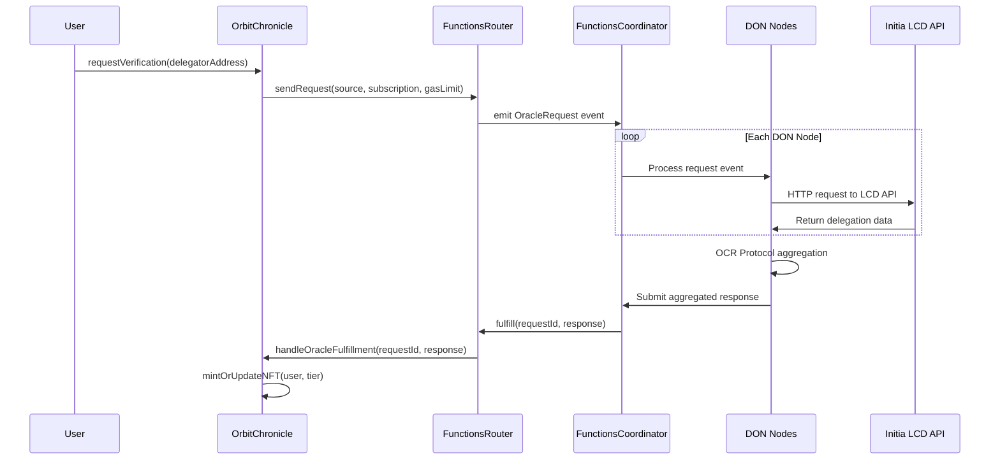

# 🔷 OrbitChronicle Smart Contracts

Solidity smart contracts powering the OrbitChronicle cross-chain loyalty system, featuring **Chainlink Functions** for delegation verification and **ERC-721 soulbound NFTs** for tier-based rewards.

## 🏗️ Architecture Overview

```
OrbitChronicle Ecosystem
├── OrbitChronicle.sol          # 🎯 Main contract with Chainlink Functions
├── OrbitChronicleNFT.sol       # 🎨 Soulbound NFT with dynamic metadata
```

### Core Components

- **OrbitChronicle**: Main contract handling delegation verification via Chainlink Functions
- **OrbitChronicleNFT**: ERC-721 soulbound tokens with tier-based rewards and IPFS metadata
- **Chainlink Functions**: Cross-chain delegation verification from Cosmos to EVM

## ✨ Key Features

- 🔗 **Chainlink Functions Integration**: Automated cross-chain delegation verification
- 🎨 **Dynamic NFTs**: Tier-based soulbound tokens with evolving metadata
- 🔒 **Soulbound Mechanism**: Non-transferable tokens tied to wallet addresses
- 💎 **Tier System**: Asteroid → Comet → Star → Galaxy progression
- 📊 **IPFS Integration**: Decentralized metadata and artwork storage
- ⚡ **Gas Optimized**: Efficient contract design for minimal transaction costs

## 🚀 Quick Start

### Prerequisites

- [Foundry](https://book.getfoundry.sh/getting-started/installation) installed
- Base Sepolia testnet ETH
- [Chainlink Functions subscription](https://functions.chain.link/)

### Setup

```bash
# Clone and navigate
git clone <repository>
cd contracts

# Install dependencies
forge install

# Build contracts
forge build

# Run tests
forge test
```

## 📋 Contract Details

### OrbitChronicle.sol

Main contract managing the delegation verification flow:

```solidity
// Core functions
function requestVerification(string memory delegatorAddress) external
function fulfillRequest(bytes32 requestId, bytes memory response, bytes memory err) internal
function mintOrUpdateNFT(address user, uint256 tier) internal
```

**Key Features:**

- Chainlink Functions integration for cross-chain verification
- Automatic NFT minting/updating based on delegation tiers
- Request tracking and error handling
- Gas-efficient verification flow

### OrbitChronicleNFT.sol

ERC-721 soulbound NFT with dynamic properties:

```solidity
// Core functions
function mint(address to, uint256 tier) external onlyOrbitChronicle
function updateTier(uint256 tokenId, uint256 newTier) external onlyOrbitChronicle
function tokenURI(uint256 tokenId) public view returns (string memory)
```

**Key Features:**

- Soulbound (non-transferable) mechanism
- Dynamic metadata based on delegation tier
- IPFS integration for artwork and metadata
- Role-based access control

## 🎯 Tier System

| Tier | Name        | Min Delegation | NFT Features          |
| ---- | ----------- | -------------- | --------------------- |
| 1    | 🪨 Asteroid | 5+ INIT        | Basic silver design   |
| 2    | ☄️ Comet    | 20+ INIT       | Enhanced blue theme   |
| 3    | ⭐ Star     | 100+ INIT      | Golden star effects   |
| 4    | 🌌 Galaxy   | 1000+ INIT     | Premium purple galaxy |

Each tier comes with:

- Unique IPFS artwork
- Different reward multipliers
- Exclusive UI themes
- Special recognition badges

## 🔧 Development

### Build

```bash
# Compile contracts
forge build

# Compile with optimizations
forge build --optimizer-runs 10000
```

### Testing

```bash
# Run all tests
forge test

# Run with verbose output
forge test -vvv

# Run specific test
forge test --match-contract OrbitChronicleTest

# Generate coverage report
forge coverage
```

### Local Development

```bash
# Start local node
anvil

# Deploy to local network (new terminal)
forge script script/OrbitScript.s.sol --rpc-url http://localhost:8545 --private-key <private_key> --broadcast
```

### Gas Analysis

```bash
# Generate gas snapshots
forge snapshot

# Compare gas usage
forge snapshot --diff .gas-snapshot
```

## 🚀 Deployment

### Base Sepolia Deployment

```bash
forge script script/OrbitScript.s.sol \
  --rpc-url base-sepolia \
  --account dev \
  --sender 0x965b0e63e00e7805569ee3b428cf96330dfc57ef \
  --optimize \
  --optimizer-runs 10000 \
  --broadcast \
  --verify \
  -vvvv
```

### Environment Variables

Create `.env` file:

```bash
# Chainlink Functions
CHAINLINK_FUNCTIONS_SUBSCRIPTION_ID=123
CHAINLINK_FUNCTIONS_ROUTER=0x...
CHAINLINK_DON_ID=fun-base-sepolia-1

# Deployment
PRIVATE_KEY=0x...
BASE_SEPOLIA_RPC_URL=https://sepolia.base.org
ETHERSCAN_API_KEY=your_api_key
```

### Verification

```bash
# Verify contracts on Etherscan
forge verify-contract \
  --chain-id 84532 \
  --num-of-optimizations 10000 \
  --constructor-args $(cast abi-encode "constructor(address,bytes32,uint64)" $ROUTER $DON_ID $SUBSCRIPTION_ID) \
  <CONTRACT_ADDRESS> \
  src/OrbitChronicle.sol:OrbitChronicle \
  --etherscan-api-key $ETHERSCAN_API_KEY
```

## 📊 Contract Addresses

### Base Sepolia Testnet

| Contract          | Address                                      | Etherscan                                                                               |
| ----------------- | -------------------------------------------- | --------------------------------------------------------------------------------------- |
| OrbitChronicle    | `0x5F131D2C6ea405d8e57845a409CcE5B168176634` | [View](https://sepolia.basescan.org/address/0x5F131D2C6ea405d8e57845a409CcE5B168176634) |
| OrbitChronicleNFT | `0x3D14794D6bC6B67E4C335F922AE0DeBfE4dFC648` | [View](https://sepolia.basescan.org/address/0x3D14794D6bC6B67E4C335F922AE0DeBfE4dFC648) |

## 🔗 Chainlink Functions Integration

Chainlink Functions enables **serverless, decentralized computation** using the [Request and Receive Data model](https://docs.chain.link/chainlink-functions/resources/architecture). Our JavaScript verification code runs on a **Decentralized Oracle Network (DON)** with **Offchain Reporting (OCR)** protocol for secure aggregation.

### Architecture Components

- **🏗️ FunctionsRouter**: Entry point managing subscriptions and request routing
- **🎯 FunctionsCoordinator**: Interface between smart contracts and DON
- **🌐 DON Nodes**: Independent oracle nodes executing JavaScript in sandboxed environments
- **🔄 OCR Protocol**: Aggregates responses from multiple nodes for consensus
- **🔐 Secrets Management**: Threshold encryption for secure API keys and sensitive data

### DON Architecture Benefits

- **🔒 Decentralized Execution**: Code runs independently on multiple oracle nodes
- **🛡️ OCR Consensus**: Offchain Reporting protocol aggregates all node responses
- **⚡ Serverless Environment**: Each node uses isolated, sandboxed computation
- **🌐 Cross-chain Capability**: Seamless data fetching from Cosmos LCD APIs to EVM
- **🎯 Byzantine Fault Tolerance**: Survives up to 1/3 malicious or failing nodes
- **📊 LINK Token Billing**: Subscription-based model with cost estimation

### Configuration

```solidity
// Constructor parameters
address router = 0x234a5fb5Bd614a7AA2FfAB244D603abFA0Ac5C5C; // Base Sepolia
bytes32 donId = 0x66756e2d626173652d7365706f6c69612d310000000000000000000000000000;
uint64 subscriptionId = 123; // Your subscription ID
```

### Request Flow Architecture

Following the [Chainlink Functions Request and Receive Data model](https://docs.chain.link/chainlink-functions/resources/architecture):



### JavaScript Source Code

The verification logic runs trustlessly on each DON node in sandboxed environments:

```javascript
// OrbitChronicle Functions source code
// Runs independently on multiple DON nodes

// Fetch delegation data from Initia LCD API
const response = await Functions.makeHttpRequest({
  url: `https://lcd-initia.keplr.app/cosmos/staking/v1beta1/delegations/${delegatorAddress}`,
  method: "GET",
  headers: {
    "Content-Type": "application/json",
  },
});

if (response.error) {
  throw new Error(`API Error: ${response.error}`);
}

// Parse delegation amount and calculate tier
const delegations = response.data.delegation_responses || [];
const totalDelegated = delegations.reduce(
  (sum, del) => sum + parseInt(del.balance.amount),
  0
);

// Convert from micro-INIT to INIT (1 INIT = 1,000,000 micro-INIT)
const delegatedINIT = Math.floor(totalDelegated / 1000000);

// Determine tier based on delegation amount
let tier = 0;
if (delegatedINIT >= 1000) tier = 4; // Galaxy
else if (delegatedINIT >= 100) tier = 3; // Star
else if (delegatedINIT >= 20) tier = 2; // Comet
else if (delegatedINIT >= 5) tier = 1; // Asteroid

// Return tier for OCR aggregation
return Functions.encodeUint256(tier);
```

### Subscription Management

OrbitChronicle uses [LINK token subscriptions](https://docs.chain.link/chainlink-functions/resources/architecture#subscription-management) for billing:

- **Subscription ID**: Unique identifier funding our requests
- **Consumer Contract**: OrbitChronicle contract authorized to use subscription
- **LINK Balance**: Funds requests with cost estimation and reservation system
- **Effective Balance**: Available funds = Balance - Reserved (in-flight requests)

## 📡 Event Emission & Indexing

### Contract Events

OrbitChronicle emits key events for The Graph indexing and frontend updates:

```solidity
// Core events for subgraph indexing
event UserRequestSent(
    address indexed user,
    bytes32 indexed requestId,
    bool isVerification
);

event RequestFulfilled(
    bytes32 indexed id
);

event LoyaltyVerified(
    address indexed user,
    uint8 newTier,
    uint256 newAmount,
    uint256 boostPoints,
    uint256 currentScore
);

event InitialQualificationClaimed(
    address indexed user,
    uint256 indexed tokenId,
    uint8 tier,
    uint256 amount
);
```

### The Graph Integration

- **Real-time Indexing**: Subgraph tracks all contract events for instant UI updates
- **GraphQL Queries**: Frontend queries user data, tier history, and verification status
- **Historical Data**: Complete transaction and tier progression history
- **Performance**: Sub-second query responses for smooth user experience

## 🔒 Security Considerations

### Access Control

- **Role-based permissions**: Only OrbitChronicle contract can mint/update NFTs
- **Soulbound mechanism**: Prevents token transfers to maintain authenticity
- **Request validation**: Chainlink Functions requests are properly validated

### Best Practices

- ✅ **Reentrancy protection**: Using OpenZeppelin's ReentrancyGuard
- ✅ **Integer overflow protection**: Solidity 0.8+ built-in checks
- ✅ **Input validation**: All external inputs are validated
- ✅ **Emergency controls**: Pausable functionality for critical situations

## 🛠️ Tools & Utilities

### ABI Generation

```bash
# Generate ABI files for frontend integration
forge inspect OrbitChronicle abi --json > ../frontend/contracts/OrbitChronicle.json
forge inspect OrbitChronicleNFT abi --json > ../frontend/contracts/OrbitChronicleNFT.json
```

### Contract Interaction

```bash
# Check contract state
cast call $CONTRACT_ADDRESS "getTotalSupply()" --rpc-url base-sepolia

# Send transaction
cast send $CONTRACT_ADDRESS "requestVerification(string)" "init1..." \
  --private-key $PRIVATE_KEY \
  --rpc-url base-sepolia
```

### Debugging

```bash
# Debug transaction
cast run $TX_HASH --rpc-url base-sepolia

# Trace transaction
cast trace $TX_HASH --rpc-url base-sepolia
```

## 📈 Gas Optimization

### Current Gas Costs

| Function              | Gas Cost | Optimization Notes                 |
| --------------------- | -------- | ---------------------------------- |
| `requestVerification` | ~85,000  | Optimized for single storage write |
| `mintOrUpdateNFT`     | ~120,000 | Batch operations where possible    |
| `updateTier`          | ~45,000  | Minimal storage updates            |

### Optimization Techniques

- **Packed structs**: Efficient storage layout
- **Batch operations**: Reduce transaction overhead
- **Short-circuit logic**: Early returns in conditionals
- **Assembly optimizations**: Critical path optimizations

## 🔄 Upgrade Strategy

### Current Implementation

- **Immutable contracts**: No upgrade mechanism for security
- **Data migration**: Manual process for major updates
- **Version control**: Clear versioning for contract deployments

### Future Considerations

- Proxy pattern evaluation for non-critical components
- Governance-controlled upgrades for specific modules
- Backward compatibility maintenance

## 📚 References

- [Chainlink Functions Documentation](https://docs.chain.link/chainlink-functions)
- [OpenZeppelin Contracts](https://docs.openzeppelin.com/contracts/)
- [Foundry Book](https://book.getfoundry.sh/)
- [Solidity Documentation](https://docs.soliditylang.org/)
- [ERC-721 Standard](https://eips.ethereum.org/EIPS/eip-721)

## 🤝 Contributing

### Development Workflow

1. Fork the repository
2. Create feature branch: `git checkout -b feature/contract-improvement`
3. Write tests for new functionality
4. Implement changes with proper documentation
5. Run full test suite: `forge test`
6. Check gas optimization: `forge snapshot`
7. Submit pull request with detailed description

### Code Standards

- Follow [Solidity Style Guide](https://docs.soliditylang.org/en/latest/style-guide.html)
- Comprehensive NatSpec documentation
- 100% test coverage for new features
- Gas optimization considerations

## 📄 License

This project is part of the Keplr Ideathon submission and is licensed under the MIT License.

---

**🔷 Built with Foundry, secured by Chainlink, powered by the Cosmos ecosystem**
